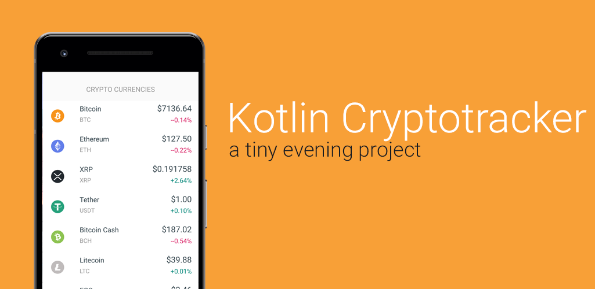

## Project Overview
A small cryptotracker App i wrote while i was learning Kotlin.

## Learnings
* Kotlin, i just started learning Kotlin three days ago :)
* Refreshed the basics in Kotlin like
  * RecylcerView
  * Working with JSON (GSON)
  * Glide
  * Volley
  * CardView/Layouts

## Credits:
- [Atomic Labs](https://github.com/atomiclabs/cryptocurrency-icons) for the Symbols
- [Coinlore API](https://api.coinlore.com/api/tickers/) for the Data
